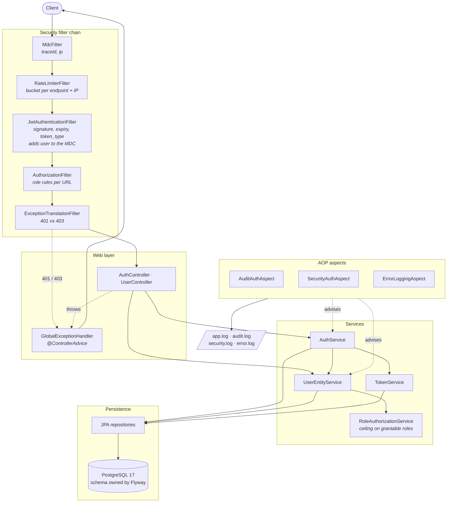

# Architecture

## The path of a request

Every request crosses the same filters before a controller ever sees it. The
order matters and is set in [`SecurityConfig`](../SpringSecurityApp/src/main/java/com/paulstna/springsecurityapp/security/SecurityConfig.java).



Two things are easy to miss in that picture.

**`MdcFilter` runs first**, so a `traceId` exists before anything can reject the
request — including the rate limiter, which turns callers away before
authentication has run. Every error body carries that same id, which is what
makes a log searchable from a bug report. The caller is not known that early, so
`JwtAuthenticationFilter` adds the user to the context once it has authenticated
one: the filter that establishes an identity is the one that records it.

**`ExceptionTranslationFilter` never reaches `@ControllerAdvice`.** Failures
raised by the chain are answered by `RestAuthenticationEntryPoint` and
`RestAccessDeniedHandler`, which write the same body the handler would, through
a shared `ErrorResponseWriter`. Without them those responses came back empty.

## Packages

Organised by feature, not by layer, so everything about tokens lives together.

```
com.paulstna.springsecurityapp
├── auth          Login, register, refresh, logout
├── user          Users, roles, the /users API
├── jwt           Token creation, parsing, hashing, persistence
├── security      Filter chain, SecurityUser, 401/403 handlers, role ceiling
├── bucket        Rate limiter buckets and their configuration
├── audit         AOP aspects, MDC keys, JPA auditing
├── exception     Error contract: the DTO, the handler, the writer
└── common        Validation rules, config, HTTP helpers
```

## Configuration by profile

Both profiles run the same migrations and seed the same demo accounts, so `dev`
and `prod` are equally testable. They differ only where they must.

| | `dev` | `prod` |
|---|---|---|
| Refresh cookie `Secure` | `false` — works over `http://localhost` | `true` |
| Application log level | `DEBUG` | `INFO` |
| SQL logging | on | off |
| Schema management | Flyway, `ddl-auto=validate` | same |

Selected with `SPRING_PROFILES_ACTIVE` in `.env`. It defaults to `prod`, so a
missing entry can never silently downgrade cookie security.

## Build and runtime

The [`Dockerfile`](../SpringSecurityApp/Dockerfile) is a three-stage build:
dependencies are resolved in their own layer so a source change does not
re-download the world, the jar is built in the second, and the third is a JRE
Alpine image running as a non-root user.

`compose.yaml` waits for PostgreSQL to report healthy before starting the
application, and keeps the audit trail in a named volume so it survives the
container.

The volume is deliberately not a bind mount to `./logs`. The container runs as a
non-root user, and Docker creates a missing bind-mount directory owned by root,
so on a clean host the application could not open its log files — and it refuses
to start rather than run without an audit trail, which is the right failure for
a service whose point is that trail. Read them with
`docker compose exec spring-security-app tail -f /app/logs/security.log`.

## See also

- [Authentication flows](auth-flow.md) — login, refresh rotation, logout
- [Data model](er-diagram.md)
- [Security model](SECURITY.md)
- [Design decisions](adr/README.md)
