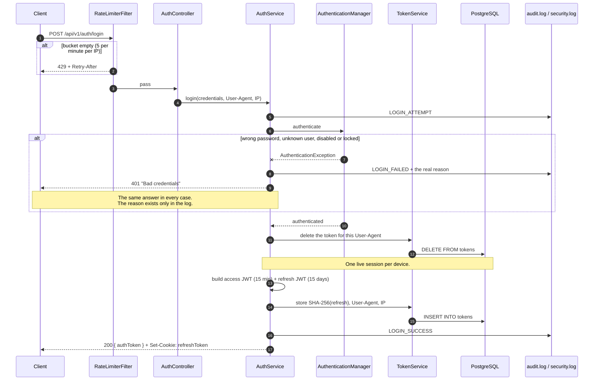
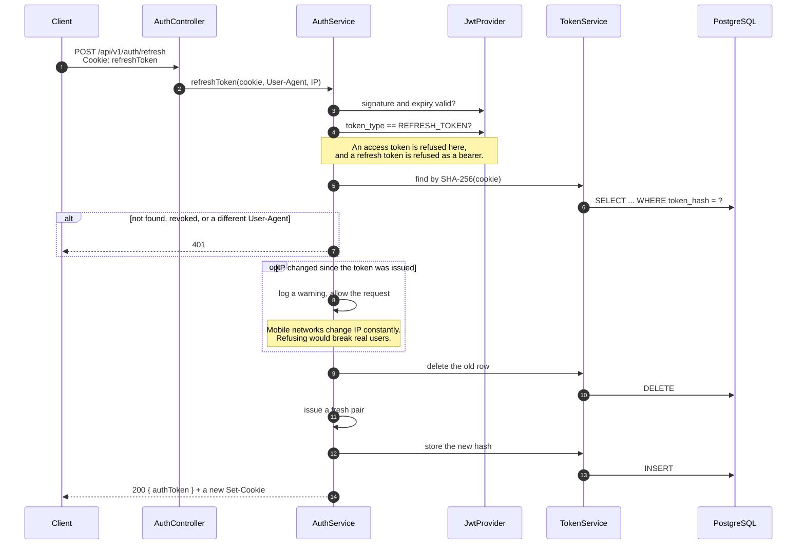
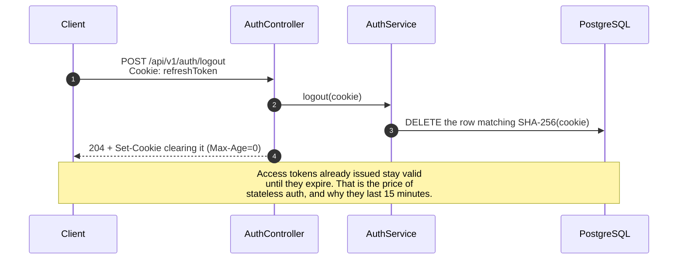

# Authentication flows

Two tokens with different jobs. The **access token** is a bearer JWT the client
sends on every call, valid 15 minutes, never stored server side. The **refresh
token** is a JWT the client never touches: it lives in an `HttpOnly` cookie
scoped to `/api/v1/auth`, valid 15 days, and only its SHA-256 hash is kept in
the database.

Why two, and why the cookie, is in [ADR 0001](adr/0001-jwt-access-plus-refresh-cookie.md).

## Login



`register` is the same shape: it creates the account with `ROLE_USER`, then
issues the identical pair, so a new user is signed in without a second call.

## Refresh, with rotation

The old token is destroyed before the new one is issued. A stolen refresh token
is therefore usable at most once, and only from the client that obtained it.



## Logout



Logging out twice is not an error: the second call finds nothing to delete and
still answers `204`. The cookie path is `/api/v1/auth`, which covers both
`/refresh` and `/logout` — it was once `/api/v1/auth/refresh`, so the browser
never sent the cookie to `/logout` and the session could not be revoked at all.

## What a client sees when something fails

| Status | Meaning | Where it comes from |
|---|---|---|
| `400` | The payload broke a validation rule | `MethodArgumentNotValidException`, with `fieldErrors` |
| `401` | No usable credential: absent, malformed, expired, wrong type, or the account is disabled | `RestAuthenticationEntryPoint`, or the handler for a bad login |
| `403` | Authenticated, but the role is not enough | `RestAccessDeniedHandler` |
| `409` | The username is taken | `ResourceAlreadyExistsException` |
| `429` | Rate limit hit, with `Retry-After` | `RateLimiterFilter` |

All five share one body, `traceId` included:

```json
{
  "timestamp": "2026-07-25T23:22:14.883Z",
  "status": 401,
  "message": "Authentication required",
  "path": "/api/v1/users",
  "traceId": "f06d14a1-1dee-454f-9822-6b3d0c18a985"
}
```

The split between `401` and `403` is the useful part: one tells a client to
refresh and retry, the other tells it not to bother.
