# Data model

The schema is owned by [Flyway migrations](../SpringSecurityApp/src/main/resources/db/migration),
and Hibernate runs with `ddl-auto=validate`: it checks the entities against the
schema at startup and refuses to boot if they disagree. Nothing is ever created
by inference.

```mermaid
erDiagram
    users ||--o{ tokens : "has sessions"
    users }o--o{ roles : "granted via users_roles"

    users {
        uuid        id                PK
        varchar_50  username          UK "not null"
        varchar_255 password             "BCrypt, {bcrypt} prefixed"
        boolean     enabled              "false blocks login and live tokens"
        boolean     account_non_locked   "same effect, different reason"
        uuid        created_by           "FK-less audit stamp"
        uuid        updated_by
        timestamp   created_at
        timestamp   updated_at
    }

    roles {
        serial      id         PK
        varchar_50  role_name  UK "ROLE_SYSTEM, ROLE_ADMIN, ROLE_MANAGER, ROLE_USER"
    }

    users_roles {
        uuid    user_id  PK "FK to users, on delete cascade"
        integer role_id  PK "FK to roles, on delete cascade"
    }

    tokens {
        uuid        id          PK
        varchar_64  token_hash  UK "SHA-256 hex of the refresh JWT"
        varchar_50  token_type     "REFRESH_TOKEN"
        boolean     revoked
        varchar_255 user_agent     "the session is bound to it"
        varchar_45  ip_address     "IPv6 fits in 45 characters"
        uuid        user_id     FK "on delete cascade"
        uuid        created_by
        uuid        updated_by
        timestamp   created_at
        timestamp   updated_at
    }
```

## Why the columns are what they are

**`tokens.token_hash`, not the token.** A refresh token is a live credential
for fifteen days. Storing the raw JWT means a database dump is a pile of usable
sessions. The column holds `SHA-256(token)` as hex — always 64 characters,
hence `VARCHAR(64)` — and lookups hash the incoming cookie before querying. No
salt and no BCrypt: the input is already 256 bits of unguessable entropy, so a
fast digest is the right tool and a slow one would only cost latency on every
refresh. See [ADR 0001](adr/0001-jwt-access-plus-refresh-cookie.md).

**`user_agent` is `NOT NULL` and part of the session's identity.** A refresh
token presented by a different client is refused, and logging in from the same
client deletes the previous row — one live session per device.

**`enabled` and `account_non_locked` are real columns.** They used to be
hardcoded `true` in `SecurityUser`, which meant the `DisabledException` and
`LockedException` the audit aspect already knew how to classify could never be
thrown. Now flipping either one invalidates live access tokens on the next
request, because the filter re-reads the user.

**`created_by` / `updated_by` carry no foreign key.** They are audit stamps
written by JPA auditing, and an audit trail should survive the deletion of the
user it points at.

**No cascade from users to roles at the JPA level.** Roles are a shared
catalogue. `CascadeType.ALL` on that relation once meant deleting a user
deleted `ROLE_MANAGER` itself, stripping the role from everyone else who had
it. The database-level `ON DELETE CASCADE` on `users_roles` is the correct
scope: it removes the *link*, never the role.

## The rows every environment starts with

`V2__seed_baseline.sql` is not demo data. `SystemAuditorProvider` looks up the
`SYSTEM` user to stamp `created_by` on every save and cannot persist anything
without it. That account is created **disabled**, with a BCrypt hash of a
password nobody knows, so it can audit but never authenticate.

`V3__seed_users.sql` adds the demo accounts, in every profile, so `dev` and
`prod` are both testable without hand-written SQL:

| Username | Role | Password |
|---|---|---|
| `admin` | `ROLE_ADMIN` | `Demo1234!` |
| `manager` | `ROLE_MANAGER` | `Demo1234!` |
| `user` | `ROLE_USER` | `Demo1234!` |

A real deployment drops that migration or rotates the credentials — the file
says so at the top.

## Migrations

| | |
|---|---|
| `V1__init_schema.sql` | Tables, constraints and indexes |
| `V2__seed_baseline.sql` | Role catalogue and the `SYSTEM` auditor |
| `V3__seed_users.sql` | Demo accounts |
| `V4__hash_refresh_tokens.sql` | `jwt_token` → `token_hash`, existing rows purged |

`V4` deletes every existing row on purpose: they hold raw JWTs that can never
match a hash, so leaving them would be dead weight that silently never matches.
Active sessions re-authenticate once, which is the intended effect.
